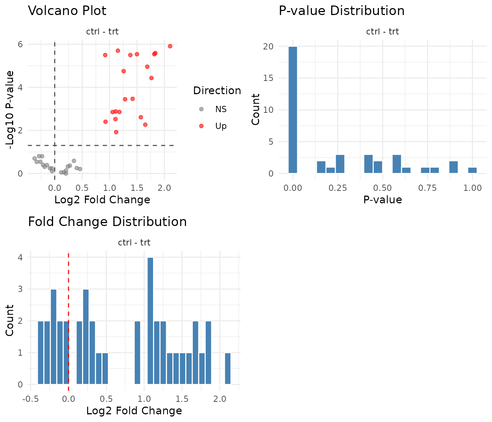

# Non-parametric Factorial Analysis with ART

``` r
library(pepdiff)
library(dplyr)
```

## What is ART?

ART (Aligned Rank Transform) is a non-parametric method for factorial
designs. It lets you analyse multi-factor experiments without assuming
your data follows a particular distribution.

**The problem it solves:** Wilcoxon and other rank tests work great for
two groups, but can’t handle interactions. Parametric ANOVA handles
interactions but assumes normality. ART gives you both: non-parametric
robustness with factorial capability.

**How it works:** 1. **Align**: Subtract out all effects except the one
you’re testing, so residuals reflect only that effect 2. **Rank**:
Convert aligned values to ranks 3. **ANOVA**: Run standard ANOVA on the
ranks

The alignment step is crucial - it allows the test to isolate each
effect (main effects, interactions) correctly.

## When to consider ART

- GLM fit diagnostics show problems (see
  [`vignette("checking_fit")`](https://teammaclean.github.io/pepdiff/articles/checking_fit.md))
- Heavy-tailed data with extreme values
- You’re uncomfortable with distributional assumptions
- Ordinal data that doesn’t meet interval scale assumptions

**Requirements:**

- Balanced-ish designs work best
- Complete cases for each peptide

## Example: 2×2 factorial design

A **2×2 factorial design** means two factors, each with two levels.
Here: treatment (ctrl, trt) × timepoint (early, late). This gives four
experimental conditions:

|          | early | late |
|----------|-------|------|
| **ctrl** | ✓     | ✓    |
| **trt**  | ✓     | ✓    |

Each peptide is measured in all four conditions (with replicates),
letting us ask: does treatment have an effect? Does that effect depend
on timepoint?

We’ll use 5 replicates per condition and simulate data with heavy tails
(extreme values) - exactly the scenario where ART shines.

### The simulated peptide groups

To illustrate how ART handles different effect patterns, we simulate 40
peptides in four groups:

| Group | Peptides    | Effect Pattern        | What ART should find                             |
|-------|-------------|-----------------------|--------------------------------------------------|
| **A** | PEP_001–010 | Treatment effect only | Main effect significant, same at both timepoints |
| **B** | PEP_011–020 | Timepoint effect only | No treatment effect (treatment comparison)       |
| **C** | PEP_021–030 | Interaction           | Treatment works at late but not early            |
| **D** | PEP_031–040 | No effect             | Nothing significant                              |

### What these patterns look like in raw data

Here’s what the mean abundances look like for each group across the four
conditions (using a baseline of ~10 for illustration):

| Group | ctrl @ early | ctrl @ late | trt @ early | trt @ late | Pattern                               |
|-------|--------------|-------------|-------------|------------|---------------------------------------|
| **A** | 10           | 10          | **30**      | **30**     | trt 3× higher at both timepoints      |
| **B** | 10           | **30**      | 10          | **30**     | late 3× higher, same for ctrl and trt |
| **C** | 10           | 10          | 10          | **40**     | trt effect only at late (interaction) |
| **D** | 10           | 10          | 10          | 10         | no differences                        |

Notice how Group C is the tricky one: treatment has no effect at early
(10 vs 10) but a 4-fold effect at late (10 vs 40). The main effect would
average these, giving ~2-fold - which doesn’t represent either timepoint
accurately.

We’ll refer back to these groups as we analyse the results.

``` r
set.seed(789)

n_peptides <- 40
n_reps <- 5  # 5 reps per condition = 20 observations per peptide

peptides <- paste0("PEP_", sprintf("%03d", 1:n_peptides))
genes <- paste0("GENE_", LETTERS[((1:n_peptides - 1) %% 26) + 1])

# Step 1: Create base abundance for each peptide
peptide_info <- tibble(

  peptide = peptides,
  gene_id = genes,
  pep_num = 1:n_peptides,
  base = rgamma(n_peptides, shape = 6, rate = 0.6)
)

# Step 2: Create the experimental design
design <- expand.grid(
  peptide = peptides,
  treatment = c("ctrl", "trt"),
  timepoint = c("early", "late"),
  bio_rep = 1:n_reps,
  stringsAsFactors = FALSE
)

# Step 3: Join design with peptide info and apply effects
# Using heavier-tailed noise to justify ART
sim_data <- design %>%
  left_join(peptide_info, by = "peptide") %>%
  mutate(
    # Group A (peptides 1-10): Treatment effect only
    # trt is 3-fold higher than ctrl, same at both timepoints
    trt_effect = ifelse(pep_num <= 10 & treatment == "trt", 3, 1),

    # Group B (peptides 11-20): Timepoint effect only
    # late is 3-fold higher than early, same for both treatments
    time_effect = ifelse(pep_num > 10 & pep_num <= 20 & timepoint == "late", 3, 1),

    # Group C (peptides 21-30): Interaction
    # Treatment works at late (4-fold) but NOT at early
    int_effect = case_when(
      pep_num > 20 & pep_num <= 30 & treatment == "trt" & timepoint == "late" ~ 4,
      TRUE ~ 1
    ),

    # Group D (peptides 31-40): No effect
    # All effect multipliers are 1

    # Add heavy-tailed noise (occasional extreme values)
    # This is why we might prefer ART over GLM
    extreme = ifelse(runif(n()) < 0.05, runif(n(), 2, 4), 1),

    # Final abundance with Gamma noise and occasional extremes
    value = rgamma(n(), shape = 10, rate = 10 / (base * trt_effect * time_effect * int_effect)) * extreme
  ) %>%
  select(peptide, gene_id, treatment, timepoint, bio_rep, value)

# Import
temp_file <- tempfile(fileext = ".csv")
write.csv(sim_data, temp_file, row.names = FALSE)

dat <- read_pepdiff(
  temp_file,
  id = "peptide",
  gene = "gene_id",
  value = "value",
  factors = c("treatment", "timepoint"),
  replicate = "bio_rep"
)

dat
#> pepdiff_data object
#> -------------------
#> Peptides: 40
#> Observations: 800
#> Factors: treatment, timepoint
#> 
#> Design:
#>   treatment=ctrl, timepoint=early: 5 reps
#>   treatment=ctrl, timepoint=late: 5 reps
#>   treatment=trt, timepoint=early: 5 reps
#>   treatment=trt, timepoint=late: 5 reps
#> 
#> No missing values
```

## Running ART analysis

``` r
results_art <- compare(
  dat,
  compare = "treatment",
  ref = "ctrl",
  method = "art"
)

results_art
#> pepdiff_results object
#> ----------------------
#> Method: art
#> Peptides: 40
#> Comparisons: 1
#> Total tests: 40
#> 
#> Significant (FDR < 0.05): 20 (50.0%)
#> Marked significant: 20
```

The interface is identical to GLM - just change `method = "art"`.

### Did ART find the treatment effects?

Since we simulated this data, we know the truth:

- **Group A**: 3-fold treatment effect at both timepoints
- **Group B**: No treatment effect (the timepoint change affects ctrl
  and trt equally)
- **Group C**: 4-fold treatment effect at late, but no effect at early
- **Group D**: No effect

Let’s see what ART finds:

``` r
results_art$results %>%
  mutate(
    pep_num = as.numeric(gsub("PEP_", "", peptide)),
    group = case_when(
      pep_num <= 10 ~ "A: Treatment only",
      pep_num <= 20 ~ "B: Timepoint only",
      pep_num <= 30 ~ "C: Interaction",
      TRUE ~ "D: No effect"
    )
  ) %>%
  group_by(group) %>%
  summarise(
    n_significant = sum(significant),
    n_peptides = n(),
    median_fc = round(median(fold_change, na.rm = TRUE), 2)
  )
#> # A tibble: 4 × 4
#>   group             n_significant n_peptides median_fc
#>   <chr>                     <int>      <int>     <dbl>
#> 1 A: Treatment only            10         10      2.75
#> 2 B: Timepoint only             0         10      0.92
#> 3 C: Interaction               10         10      2.31
#> 4 D: No effect                  0         10      1.1
```

- **Group A**: Treatment effect detected ✓
- **Group B**: Correctly negative (no treatment effect) ✓
- **Group C**: Detected, but note the diluted fold change (~2 instead
  of 4) - the main effect averages across timepoints
- **Group D**: Correctly negative ✓

``` r
plot(results_art)
```



## Stratified comparisons with `within`

Just like GLM, use `within` to get treatment effects at each timepoint
separately:

``` r
results_strat <- compare(
  dat,
  compare = "treatment",
  ref = "ctrl",
  within = "timepoint",
  method = "art"
)

results_strat
#> pepdiff_results object
#> ----------------------
#> Method: art
#> Peptides: 40
#> Comparisons: 1
#> Total tests: 80
#> 
#> Significant (FDR < 0.05): 26 (32.5%)
#> Marked significant: 26
```

### Stratified results by group

Let’s see how each group looks when we analyse timepoints separately:

``` r
results_strat$results %>%
  mutate(
    pep_num = as.numeric(gsub("PEP_", "", peptide)),
    group = case_when(
      pep_num <= 10 ~ "A: Treatment only",
      pep_num <= 20 ~ "B: Timepoint only",
      pep_num <= 30 ~ "C: Interaction",
      TRUE ~ "D: No effect"
    )
  ) %>%
  group_by(group, timepoint) %>%
  summarise(
    n_significant = sum(significant),
    median_fc = round(median(fold_change, na.rm = TRUE), 2),
    .groups = "drop"
  ) %>%
  tidyr::pivot_wider(
    names_from = timepoint,
    values_from = c(n_significant, median_fc)
  )
#> # A tibble: 4 × 5
#>   group    n_significant_early n_significant_late median_fc_early median_fc_late
#>   <chr>                  <int>              <int>           <dbl>          <dbl>
#> 1 A: Trea…                   7                  8            3.31           2.67
#> 2 B: Time…                   1                  0            0.87           0.96
#> 3 C: Inte…                   0                 10            0.95           3.63
#> 4 D: No e…                   0                  0            1.24           0.97
```

**What stratified analysis reveals:**

- **Group A**: FC ≈ 3 at both timepoints — the main effect was accurate
- **Group B**: FC ≈ 1 at both timepoints, 0 significant — correctly
  negative at both
- **Group C**: FC ≈ 1 at early, FC ≈ 4 at late — now we see the true
  effect!
- **Group D**: FC ≈ 1 at both, ~0 significant — correctly negative

For Group C, stratified analysis recovers the true 4-fold effect at late
that was diluted in the main effect.

## Handling interactions

Group C illustrates an **interaction**: the treatment effect depends on
timepoint. ART handles this the same way as GLM - use `within` to get
conditional effects at each level.

For more details on interpreting interactions, see
[`vignette("glm_analysis")`](https://teammaclean.github.io/pepdiff/articles/glm_analysis.md).

## ART vs GLM comparison

Let’s compare both methods on the same data:

``` r
results_glm <- compare(dat, compare = "treatment", ref = "ctrl", method = "glm")
```

``` r
# Compare significant calls
comparison <- tibble(
  peptide = results_glm$results$peptide,
  glm_sig = results_glm$results$significant,
  art_sig = results_art$results$significant,
  glm_pval = round(results_glm$results$p_value, 4),
  art_pval = round(results_art$results$p_value, 4)
)

# Agreement
cat("Both significant:", sum(comparison$glm_sig & comparison$art_sig), "\n")
#> Both significant: 19
cat("GLM only:", sum(comparison$glm_sig & !comparison$art_sig), "\n")
#> GLM only: 1
cat("ART only:", sum(!comparison$glm_sig & comparison$art_sig), "\n")
#> ART only: 1
cat("Neither:", sum(!comparison$glm_sig & !comparison$art_sig), "\n")
#> Neither: 19
```

When both methods agree, you can be confident in the result. When they
disagree, investigate the peptide:

``` r
# Peptides where methods disagree
disagreements <- comparison %>%
  filter(glm_sig != art_sig) %>%
  arrange(pmin(glm_pval, art_pval))

if (nrow(disagreements) > 0) {
  print(disagreements)
} else {
  cat("No disagreements between methods\n")
}
#> # A tibble: 2 × 5
#>   peptide glm_sig art_sig glm_pval art_pval
#>   <chr>   <lgl>   <lgl>      <dbl>    <dbl>
#> 1 PEP_022 FALSE   TRUE      0.0363    0.004
#> 2 PEP_016 TRUE    FALSE     0.0128    0.158
```

## Diagnostics

``` r
results_art$diagnostics %>%
  head()
#> # A tibble: 6 × 7
#>   peptide converged error deviance residuals    std_residuals fitted      
#>   <chr>   <lgl>     <chr>    <dbl> <named list> <named list>  <named list>
#> 1 PEP_001 TRUE      NA          NA <dbl [20]>   <NULL>        <NULL>      
#> 2 PEP_002 TRUE      NA          NA <dbl [20]>   <NULL>        <NULL>      
#> 3 PEP_003 TRUE      NA          NA <dbl [20]>   <NULL>        <NULL>      
#> 4 PEP_004 TRUE      NA          NA <dbl [20]>   <NULL>        <NULL>      
#> 5 PEP_005 TRUE      NA          NA <dbl [20]>   <NULL>        <NULL>      
#> 6 PEP_006 TRUE      NA          NA <dbl [20]>   <NULL>        <NULL>
```

The `error` column contains diagnostic messages only when models fail -
`NA` means success. Check convergence:

``` r
n_converged <- sum(results_art$diagnostics$converged)
n_failed <- sum(!results_art$diagnostics$converged)

cat("Converged:", n_converged, "\n")
#> Converged: 40
cat("Failed:", n_failed, "\n")
#> Failed: 0
```

The same diagnostic plots apply:

- Volcano should be symmetric
- P-value histogram should show uniform + spike pattern
- Fold change distribution should centre near zero

## Exporting results

The results are stored in a tidy tibble:

``` r
glimpse(results_art$results)
#> Rows: 40
#> Columns: 11
#> $ peptide     <chr> "PEP_001", "PEP_002", "PEP_003", "PEP_004", "PEP_005", "PE…
#> $ gene_id     <chr> "GENE_A", "GENE_B", "GENE_C", "GENE_D", "GENE_E", "GENE_F"…
#> $ comparison  <chr> "ctrl - trt", "ctrl - trt", "ctrl - trt", "ctrl - trt", "c…
#> $ fold_change <dbl> 2.2658580, 3.5678933, 3.5203738, 2.6765771, 4.3006451, 2.8…
#> $ log2_fc     <dbl> 1.18005748, 1.83507248, 1.81572864, 1.42038920, 2.10455309…
#> $ estimate    <dbl> -8.00000e+00, -1.00000e+01, -1.00000e+01, -8.60000e+00, -1…
#> $ se          <dbl> 2.073644, 1.410674, 1.424781, 1.898684, 1.330413, 1.424781…
#> $ test        <chr> "art", "art", "art", "art", "art", "art", "art", "art", "a…
#> $ p_value     <dbl> 1.391822e-03, 2.565233e-06, 2.899704e-06, 3.420731e-04, 1.…
#> $ fdr         <dbl> 3.746732e-03, 1.812999e-05, 1.812999e-05, 1.192848e-03, 1.…
#> $ significant <lgl> TRUE, TRUE, TRUE, TRUE, TRUE, TRUE, TRUE, TRUE, TRUE, TRUE…
```

Stratified results include the timepoint column:

``` r
glimpse(results_strat$results)
#> Rows: 80
#> Columns: 13
#> $ peptide     <chr> "PEP_001", "PEP_002", "PEP_003", "PEP_004", "PEP_005", "PE…
#> $ gene_id     <chr> "GENE_A", "GENE_B", "GENE_C", "GENE_D", "GENE_E", "GENE_F"…
#> $ comparison  <chr> "ctrl - trt", "ctrl - trt", "ctrl - trt", "ctrl - trt", "c…
#> $ fold_change <dbl> 2.5351923, 4.3127474, 3.8037220, 3.6106241, 5.5918984, 3.0…
#> $ log2_fc     <dbl> 1.342095192, 2.108607216, 1.927411826, 1.852248235, 2.4833…
#> $ estimate    <dbl> -3.8, -5.0, -5.0, -5.0, -5.0, -5.0, -5.0, -3.8, -3.0, -5.0…
#> $ se          <dbl> 1.523155, 1.000000, 1.000000, 1.000000, 1.000000, 1.000000…
#> $ test        <chr> "art", "art", "art", "art", "art", "art", "art", "art", "a…
#> $ p_value     <dbl> 0.037241306, 0.001052826, 0.001052826, 0.001052826, 0.0010…
#> $ fdr         <dbl> 0.148965224, 0.006016147, 0.006016147, 0.006016147, 0.0060…
#> $ significant <lgl> FALSE, TRUE, TRUE, TRUE, TRUE, TRUE, TRUE, FALSE, FALSE, T…
#> $ stratum     <chr> "timepoint=early", "timepoint=early", "timepoint=early", "…
#> $ timepoint   <chr> "early", "early", "early", "early", "early", "early", "ear…
```

Save to CSV for downstream analysis:

``` r
# All results
write.csv(results_art$results, "art_results.csv", row.names = FALSE)

# Significant hits only
results_art$results %>%
  filter(significant) %>%
  write.csv("art_significant.csv", row.names = FALSE)

# Stratified results
write.csv(results_strat$results, "art_stratified.csv", row.names = FALSE)
```

## Limitations of ART

**Speed:** ART is slower than GLM because it fits multiple aligned
models per peptide. For large datasets, this matters.

**Interpretation:** Rank-based effects are less intuitive than fold
changes. “Treatment increases ranks” is harder to communicate than
“treatment doubles abundance”.

**Balance:** ART works best with balanced designs (equal n per cell).
Unbalanced designs can give unreliable interaction tests.

**Not a magic fix:** If your data has fundamental problems (outlier
samples, batch effects), ART won’t save you. Fix the problems first.

## Practical recommendations

1.  **Start with GLM** - it’s the default for good reason
2.  **Check GLM fit** - run `plot_fit_diagnostics(results)` (see
    [`vignette("checking_fit")`](https://teammaclean.github.io/pepdiff/articles/checking_fit.md))
3.  **If diagnostics look poor**, try ART on the same data
4.  **Compare results** - where do methods agree and disagree?
5.  **For publication**, report which method you used and why

**Decision tree:**

    GLM diagnostics OK?
      → Yes: Use GLM
      → No: Try ART
             ↓
           ART diagnostics OK?
             → Yes: Use ART
             → No: You may need more data, or the effect isn't there

## When both methods fail

If neither GLM nor ART gives sensible results:

1.  **Check data quality**: Outlier samples, batch effects,
    normalisation issues
2.  **Consider sample size**: May not have power to detect effects
3.  **Simplify the model**: Too many factors for the data?
4.  **Accept the null**: Sometimes there’s no effect to find

See peppwR for power analysis to understand what effect sizes your
experiment can detect.
