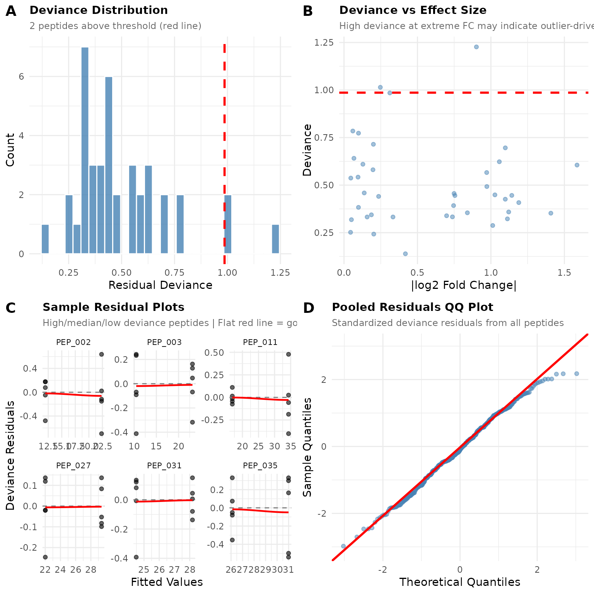
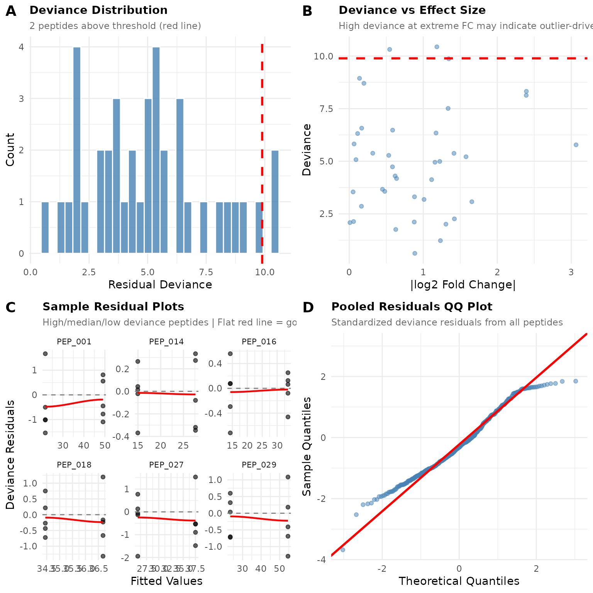

# Checking GLM Model Fit

``` r
library(pepdiff)
library(dplyr)
```

## Why Check Model Fit?

pepdiff uses a **Gamma GLM with log link** for differential abundance
analysis. This model assumes:

- Abundances are positive (no zeros)
- Variance increases with the mean (common in proteomics)
- The relationship between predictors and response is multiplicative
  (log-linear)

When these assumptions hold, GLM gives reliable p-values and accurate
fold change estimates. When they don’t, results may be misleading.

**The good news:** You don’t need a statistics degree to check model
fit.
[`plot_fit_diagnostics()`](https://teammaclean.github.io/pepdiff/reference/plot_fit_diagnostics.md)
gives you visual checks that tell you whether to trust your GLM results
or try ART instead.

## Quick Check with plot_fit_diagnostics()

Let’s start with simulated data that fits the GLM assumptions well.

``` r
set.seed(123)

n_peptides <- 40
n_reps <- 5

peptides <- paste0("PEP_", sprintf("%03d", 1:n_peptides))
genes <- paste0("GENE_", LETTERS[((1:n_peptides - 1) %% 26) + 1])

# Simulate well-behaved Gamma data
design <- expand.grid(
  peptide = peptides,
  treatment = c("ctrl", "trt"),
  bio_rep = 1:n_reps,
  stringsAsFactors = FALSE
)

sim_data <- design %>%
  mutate(
    gene_id = genes[match(peptide, peptides)],
    pep_num = as.numeric(gsub("PEP_", "", peptide)),
    base = 10 + pep_num * 0.5,
    # First 20 peptides have 2-fold treatment effect
    effect = ifelse(pep_num <= 20 & treatment == "trt", 2, 1),
    # Gamma noise (well-behaved)
    value = rgamma(n(), shape = 15, rate = 15 / (base * effect))
  ) %>%
  select(peptide, gene_id, treatment, bio_rep, value)

# Import
temp_file <- tempfile(fileext = ".csv")
write.csv(sim_data, temp_file, row.names = FALSE)

dat <- read_pepdiff(
  temp_file,
  id = "peptide",
  gene = "gene_id",
  value = "value",
  factors = "treatment",
  replicate = "bio_rep"
)

unlink(temp_file)
```

Run GLM analysis and check diagnostics:

``` r
results <- compare(dat, compare = "treatment", ref = "ctrl", method = "glm")

# Check fit diagnostics
diag <- plot_fit_diagnostics(results)
#> Warning in simpleLoess(y, x, w, span, degree = degree, parametric = parametric,
#> : pseudoinverse used at 11.91
#> Warning in simpleLoess(y, x, w, span, degree = degree, parametric = parametric,
#> : neighborhood radius 10.432
#> Warning in simpleLoess(y, x, w, span, degree = degree, parametric = parametric,
#> : reciprocal condition number 0
#> Warning in simpleLoess(y, x, w, span, degree = degree, parametric = parametric,
#> : There are other near singularities as well. 108.84
#> Warning in simpleLoess(y, x, w, span, degree = degree, parametric = parametric,
#> : pseudoinverse used at 10.412
#> Warning in simpleLoess(y, x, w, span, degree = degree, parametric = parametric,
#> : neighborhood radius 12.708
#> Warning in simpleLoess(y, x, w, span, degree = degree, parametric = parametric,
#> : reciprocal condition number 0
#> Warning in simpleLoess(y, x, w, span, degree = degree, parametric = parametric,
#> : There are other near singularities as well. 161.49
#> Warning in simpleLoess(y, x, w, span, degree = degree, parametric = parametric,
#> : pseudoinverse used at 16.759
#> Warning in simpleLoess(y, x, w, span, degree = degree, parametric = parametric,
#> : neighborhood radius 17.579
#> Warning in simpleLoess(y, x, w, span, degree = degree, parametric = parametric,
#> : reciprocal condition number 0
#> Warning in simpleLoess(y, x, w, span, degree = degree, parametric = parametric,
#> : There are other near singularities as well. 309.01
#> Warning in simpleLoess(y, x, w, span, degree = degree, parametric = parametric,
#> : pseudoinverse used at 21.973
#> Warning in simpleLoess(y, x, w, span, degree = degree, parametric = parametric,
#> : neighborhood radius 7.4351
#> Warning in simpleLoess(y, x, w, span, degree = degree, parametric = parametric,
#> : reciprocal condition number 0
#> Warning in simpleLoess(y, x, w, span, degree = degree, parametric = parametric,
#> : There are other near singularities as well. 55.281
#> Warning in simpleLoess(y, x, w, span, degree = degree, parametric = parametric,
#> : pseudoinverse used at 24.471
#> Warning in simpleLoess(y, x, w, span, degree = degree, parametric = parametric,
#> : neighborhood radius 3.7109
#> Warning in simpleLoess(y, x, w, span, degree = degree, parametric = parametric,
#> : reciprocal condition number 0
#> Warning in simpleLoess(y, x, w, span, degree = degree, parametric = parametric,
#> : There are other near singularities as well. 13.771
#> Warning in simpleLoess(y, x, w, span, degree = degree, parametric = parametric,
#> : pseudoinverse used at 26.085
#> Warning in simpleLoess(y, x, w, span, degree = degree, parametric = parametric,
#> : neighborhood radius 4.9087
#> Warning in simpleLoess(y, x, w, span, degree = degree, parametric = parametric,
#> : reciprocal condition number 0
#> Warning in simpleLoess(y, x, w, span, degree = degree, parametric = parametric,
#> : There are other near singularities as well. 24.095
#> 
#> GLM Fit Diagnostics
#> -------------------
#> Peptides analyzed: 40 (all converged)
#> Median deviance: 0.45
#> Threshold: 0.99 (95th percentile)
#> Flagged peptides: 2 (5.0%) above threshold
#> 
#> Interpretation: Some peptides show elevated deviance. Check residual plots.
#> See vignette('checking_fit') for detailed guidance.
```

``` r
diag$plot
```



## Reading the Diagnostic Plots

### Panel A: Deviance Distribution

This histogram shows how well each peptide’s GLM model fits its data.
**Lower deviance = better fit.**

**What to look for:** - Most peptides should cluster at low deviance
values - A few peptides above the red threshold line is normal (by
default, 5%) - A long right tail means some peptides fit poorly

**In our example:** The distribution is compact with only a few peptides
above the threshold. This looks healthy.

### Panel B: Deviance vs Effect Size

This scatter plot reveals whether poorly-fitting peptides cluster at
certain effect sizes.

**What to look for:** - Random scatter = no systematic problem - High
deviance at extreme fold changes = outlier-driven “significant” results
(red flag) - Curved pattern = systematic misfit

**In our example:** Points are scattered without clear pattern. No
obvious relationship between fold change and fit quality.

### Panel C: Sample Residual Plots

These show residuals (observed - predicted) vs fitted values for
individual peptides. The function selects peptides with high, median,
and low deviance to give you a representative sample.

**What good fit looks like:** - Points scattered randomly around zero
(the dashed line) - No funnel shape (variance shouldn’t change with
fitted value) - Flat red loess line (no trend)

**What poor fit looks like:** - Curved pattern in points - Funnel shape
(variance increasing or decreasing) - Curved red loess line

**In our example:** The residual plots show random scatter around zero
with mostly flat loess lines.

### Panel D: Pooled QQ Plot

This combines residuals from all peptides to check if they follow the
expected distribution.

**What good fit looks like:** - Points fall along the diagonal line -
Minor wiggles at the tails are OK

**What poor fit looks like:** - S-shaped curve = heavy tails (consider
ART) - Systematic bow = wrong distributional assumption - Points far
from line = outliers

**In our example:** Points follow the line reasonably well, suggesting
the Gamma distribution is appropriate.

## Investigating Flagged Peptides

The function identifies peptides with potential fit issues:

``` r
diag$flagged
#> # A tibble: 2 × 7
#>   peptide gene_id deviance fold_change p_value significant flag_reason  
#>   <chr>   <chr>      <dbl>       <dbl>   <dbl> <lgl>       <chr>        
#> 1 PEP_002 GENE_B      1.23        1.87  0.0330 FALSE       high_deviance
#> 2 PEP_035 GENE_I      1.01        1.19  0.441  FALSE       high_deviance
```

``` r
# Summary statistics
diag$summary
#> $n_analyzed
#> [1] 40
#> 
#> $n_converged
#> [1] 40
#> 
#> $n_failed
#> [1] 0
#> 
#> $median_deviance
#> [1] 0.4457115
#> 
#> $threshold
#>      95% 
#> 0.986245 
#> 
#> $n_flagged
#> [1] 2
#> 
#> $pct_flagged
#> [1] 5
```

If peptides are flagged, investigate them:

1.  **Check the data** - Do these peptides have outliers, zeros, or
    unusual patterns?
2.  **Look at sample size** - Low replication can cause fitting issues
3.  **Consider biology** - Are these peptides biologically different?

## Example: Data with Poor Fit

Let’s simulate data that violates GLM assumptions - heavy tails with
outliers:

``` r
set.seed(456)

# Same design but with outliers and heavy tails
sim_bad <- design %>%
  mutate(
    gene_id = genes[match(peptide, peptides)],
    pep_num = as.numeric(gsub("PEP_", "", peptide)),
    base = 10 + pep_num * 0.5,
    effect = ifelse(pep_num <= 20 & treatment == "trt", 2, 1),
    # Add outliers (10% of observations)
    outlier = ifelse(runif(n()) < 0.1, runif(n(), 3, 8), 1),
    # Heavier-tailed noise
    value = rgamma(n(), shape = 3, rate = 3 / (base * effect)) * outlier
  ) %>%
  select(peptide, gene_id, treatment, bio_rep, value)

temp_file <- tempfile(fileext = ".csv")
write.csv(sim_bad, temp_file, row.names = FALSE)

dat_bad <- read_pepdiff(
  temp_file,
  id = "peptide",
  gene = "gene_id",
  value = "value",
  factors = "treatment",
  replicate = "bio_rep"
)

unlink(temp_file)
```

``` r
results_bad <- compare(dat_bad, compare = "treatment", ref = "ctrl", method = "glm")
diag_bad <- plot_fit_diagnostics(results_bad)
#> Warning in simpleLoess(y, x, w, span, degree = degree, parametric = parametric,
#> : pseudoinverse used at 21.493
#> Warning in simpleLoess(y, x, w, span, degree = degree, parametric = parametric,
#> : neighborhood radius 27.638
#> Warning in simpleLoess(y, x, w, span, degree = degree, parametric = parametric,
#> : reciprocal condition number 0
#> Warning in simpleLoess(y, x, w, span, degree = degree, parametric = parametric,
#> : There are other near singularities as well. 763.86
#> Warning in simpleLoess(y, x, w, span, degree = degree, parametric = parametric,
#> : pseudoinverse used at 14.896
#> Warning in simpleLoess(y, x, w, span, degree = degree, parametric = parametric,
#> : neighborhood radius 12.748
#> Warning in simpleLoess(y, x, w, span, degree = degree, parametric = parametric,
#> : reciprocal condition number 0
#> Warning in simpleLoess(y, x, w, span, degree = degree, parametric = parametric,
#> : There are other near singularities as well. 162.51
#> Warning in simpleLoess(y, x, w, span, degree = degree, parametric = parametric,
#> : pseudoinverse used at 14.22
#> Warning in simpleLoess(y, x, w, span, degree = degree, parametric = parametric,
#> : neighborhood radius 19.399
#> Warning in simpleLoess(y, x, w, span, degree = degree, parametric = parametric,
#> : reciprocal condition number 0
#> Warning in simpleLoess(y, x, w, span, degree = degree, parametric = parametric,
#> : There are other near singularities as well. 376.31
#> Warning in simpleLoess(y, x, w, span, degree = degree, parametric = parametric,
#> : pseudoinverse used at 34.436
#> Warning in simpleLoess(y, x, w, span, degree = degree, parametric = parametric,
#> : neighborhood radius 2.2455
#> Warning in simpleLoess(y, x, w, span, degree = degree, parametric = parametric,
#> : reciprocal condition number 0
#> Warning in simpleLoess(y, x, w, span, degree = degree, parametric = parametric,
#> : There are other near singularities as well. 5.0422
#> Warning in simpleLoess(y, x, w, span, degree = degree, parametric = parametric,
#> : pseudoinverse used at 25.642
#> Warning in simpleLoess(y, x, w, span, degree = degree, parametric = parametric,
#> : neighborhood radius 11.877
#> Warning in simpleLoess(y, x, w, span, degree = degree, parametric = parametric,
#> : reciprocal condition number 0
#> Warning in simpleLoess(y, x, w, span, degree = degree, parametric = parametric,
#> : There are other near singularities as well. 141.07
#> Warning in simpleLoess(y, x, w, span, degree = degree, parametric = parametric,
#> : pseudoinverse used at 23.201
#> Warning in simpleLoess(y, x, w, span, degree = degree, parametric = parametric,
#> : neighborhood radius 31.311
#> Warning in simpleLoess(y, x, w, span, degree = degree, parametric = parametric,
#> : reciprocal condition number 0
#> Warning in simpleLoess(y, x, w, span, degree = degree, parametric = parametric,
#> : There are other near singularities as well. 980.4
#> 
#> GLM Fit Diagnostics
#> -------------------
#> Peptides analyzed: 40 (all converged)
#> Median deviance: 4.97
#> Threshold: 9.89 (95th percentile)
#> Flagged peptides: 2 (5.0%) above threshold
#> 
#> Interpretation: Some peptides show elevated deviance. Check residual plots.
#> See vignette('checking_fit') for detailed guidance.
```

``` r
diag_bad$plot
```



**Notice the differences:**

- **Deviance distribution** has a longer right tail with more flagged
  peptides
- **Residual plots** may show non-random patterns
- **QQ plot** deviates from the line, especially in the tails

When diagnostics look like this, ART may be more appropriate.

## Decision: GLM or ART?

### Use GLM when:

- Deviance distribution looks reasonable (few flagged, \<10-15%)
- No systematic patterns in residual plots
- QQ plot is reasonably linear
- You want interpretable fold changes

### Consider ART when:

- Many peptides (\>15%) have high deviance
- Residual plots show systematic curves or funnels
- QQ plot shows heavy tails (S-curve)
- You have known outliers or heavy-tailed data
- You’re uncomfortable with distributional assumptions

### Try ART on the problematic data:

``` r
results_art <- compare(dat_bad, compare = "treatment", ref = "ctrl", method = "art")

# Compare significant calls
comparison <- tibble(
  peptide = results_bad$results$peptide,
  glm_sig = results_bad$results$significant,
  art_sig = results_art$results$significant
)

cat("Both significant:", sum(comparison$glm_sig & comparison$art_sig), "\n")
#> Both significant: 0
cat("GLM only:", sum(comparison$glm_sig & !comparison$art_sig), "\n")
#> GLM only: 0
cat("ART only:", sum(!comparison$glm_sig & comparison$art_sig), "\n")
#> ART only: 5
```

## Summary

1.  **Always run
    [`plot_fit_diagnostics()`](https://teammaclean.github.io/pepdiff/reference/plot_fit_diagnostics.md)
    after GLM analysis** - it only takes seconds
2.  **Check all four panels** for warning signs
3.  **Investigate flagged peptides** if needed - check for data quality
    issues
4.  **Switch to ART only if diagnostics suggest systematic problems** -
    ART trades power for robustness
5.  **When in doubt, run both methods** and compare results

GLM is the default because it’s more powerful when assumptions hold. Use
diagnostics to verify those assumptions, and switch to ART when they
don’t.

See
[`vignette("art_analysis")`](https://teammaclean.github.io/pepdiff/articles/art_analysis.md)
for details on using the ART method.
